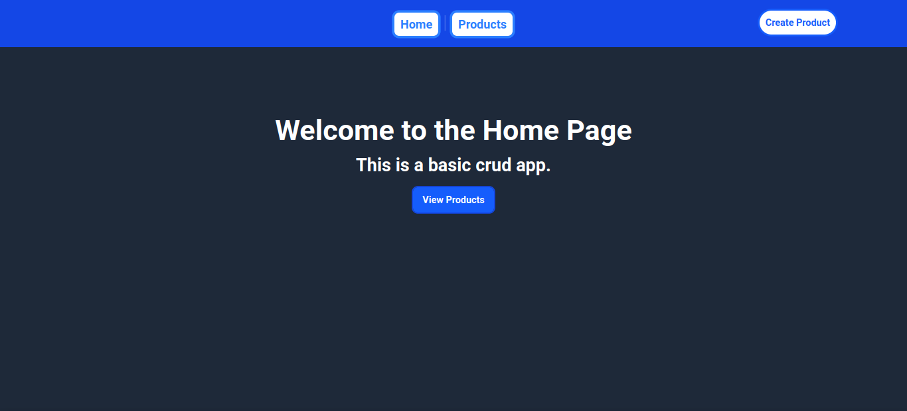
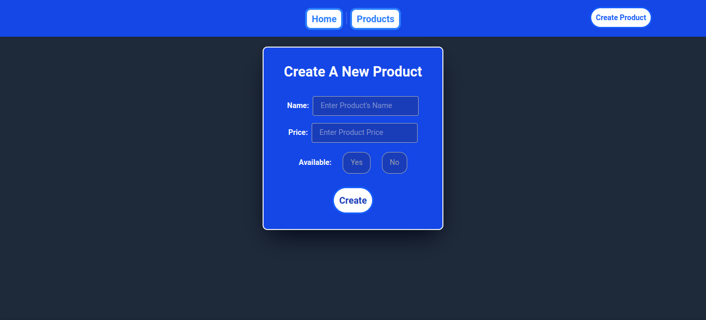
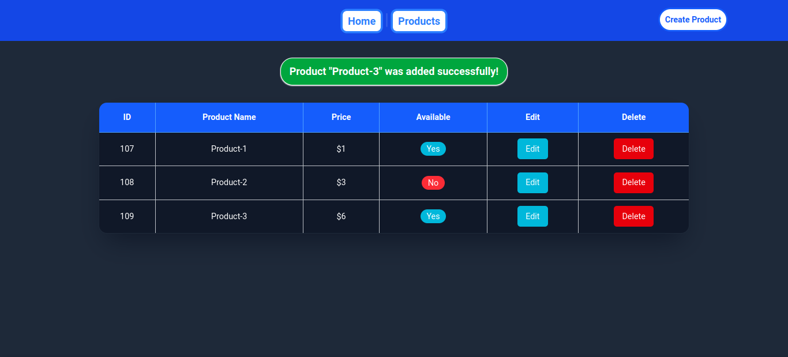
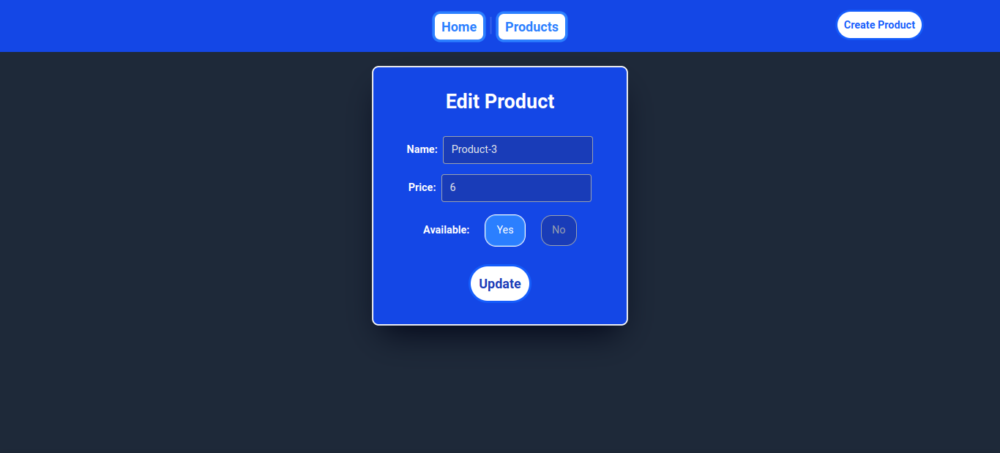

# :books: Laravel Basic CRUD

This is a simple Laravel-based CRUD (Create, Read, Update, Delete) application that demonstrates the use of **RESTful APIs**, **Eloquent ORM**, **MVC architecture**, **Blade templates**, and **MySQL** as the database.

## :rocket: Features
- Full CRUD functionality for managing products.
- Uses **Laravel Sail** for easy local development in Docker.
- Styled with **Tailwind CSS**.
- Uses **Eloquent ORM** for database interactions.
- Implements **validation** to ensure data integrity and prevent invalid inputs.
- Clean and well-structured code following Laravel best practices for maintainable and scalable code.

## :camera_flash: Screenshots
### :house_with_garden: Home Page:


### :heavy_plus_sign: Create Product Page:


### :memo: Products List Page:


### :pencil2: Edit Product Page:

<br>
<br>

## :hammer_and_wrench: Installation

### :round_pushpin: Prerequisites
- **[Docker](https://www.docker.com/) installed.**
- **[Git](https://git-scm.com/) installed.**
- **[Node.js](https://nodejs.org/) installed (ensure **npm** is included during installation).**
- **[Composer](https://getcomposer.org/) installed.**

### :gear: Setup:
_:o: Open a terminal in the directory where you want to create the project. This will be the location where all project files will be stored. Make sure you navigate to the desired folder before running the installation commands._
<br>

***:white_medium_small_square: Clone the repository:***
```sh
git clone https://github.com/Mhmdxc/Laravel_Basic-CRUD.git
cd Laravel_Basic-CRUD
```
<br>

***:white_medium_small_square: Install PHP dependencies using Composer:***
```sh
composer install
```
<br>

***:white_medium_small_square: Install JavaScript dependencies using npm:***
```sh
npm install
```
<br>

***:white_medium_small_square: Copy the example environment file:***
```sh
cp .env.example .env
```
 > Update the `.env` file with your database credentials and other necessary configurations.

 > Windows users: If 'cp .env.example .env' doesn't work, try 'copy .env.example .env'.
<br>

 > ***Windows users: Throughout this documentation, if ./vendor/bin/sail fails, try using vendor/bin/sail in PowerShell instead.***
<br>

***:white_medium_small_square: Start the containers:***
```sh
./vendor/bin/sail up -d
```
<br>

***:white_medium_small_square: Generate an application key:***
```sh
./vendor/bin/sail artisan key:generate
```
<br>

***:white_medium_small_square: Run database migrations:***
```sh
./vendor/bin/sail artisan migrate
```
 > After running the migrations, if you encounter any issues, it's likely due to MySQL not being fully loaded yet. In such cases, try waiting a couple of minutes and then re-running the migration command.
<br>

***:white_medium_small_square: Start Vite (for Tailwind styles and JS bundling):***
```sh
npm run dev
```
<br>

### :white_check_mark: - Now, the application is running and should be accessible at **http://localhost**.
<br>

## :x: Stopping the Application
**To stop the application, follow these steps:**
<br>
<br>
***:white_medium_small_square: In the terminal where your front-end development server is running, press Ctrl + C to stop the 'npm run dev' process.***
 > Windows Users: If 'Ctrl + C' fails, try 'Ctrl + Break'.
<br>

***:white_medium_small_square: Stop the Docker containers by running the following command:***
```sh
./vendor/bin/sail down
```
 > This will stop the application and remove all running Docker containers.
<br>

## :o: Starting the Application
**To start the application, run the following commands:**
<br>

***:white_medium_small_square: Start the Laravel Sail environment:***
```sh
./vendor/bin/sail up
```
 > This will start the Docker containers for your Laravel application.
<br>

***:white_medium_small_square: In another terminal window, run the following to start the development server:***
```sh
npm run dev
```
 > This will start the front-end development server
<br>

### :white_check_mark: - Once both commands are running, your application should be accessible at **http://localhost**.
<br>

## :keyboard: API Endpoints
This application provides a RESTful API for managing products:
- `GET /products` - Retrieve all products.
- `POST /products` - Create a new product.
- `GET /products/{id}` - Retrieve a specific product.
- `PUT /products/{id}` - Update a product.
- `DELETE /products/{id}` - Delete a product.
<br>

## :computer: Technologies Used
- **Laravel** (PHP framework)
- **MySQL** (Database)
- **Blade** (Laravel templating engine)
- **Eloquent ORM** (Database management)
- **Tailwind CSS** (Styling)
- **Vite** (Frontend asset bundling)
<br>

## :page_facing_up: License
This project is licensed under the **Creative Commons Attribution-NonCommercial 4.0 International License**.  
See the [LICENSE](LICENSE) file for details.  
