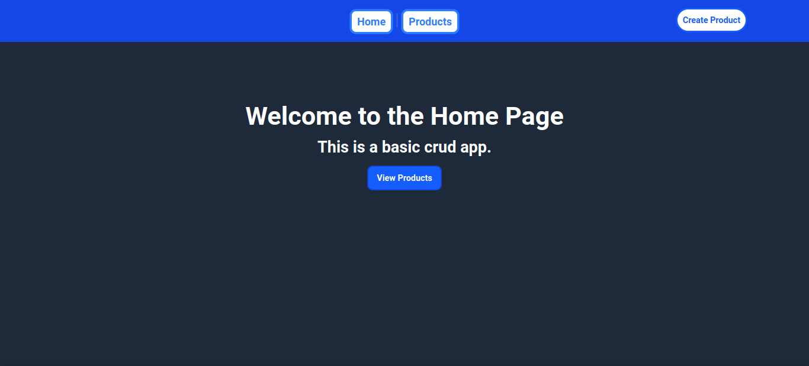
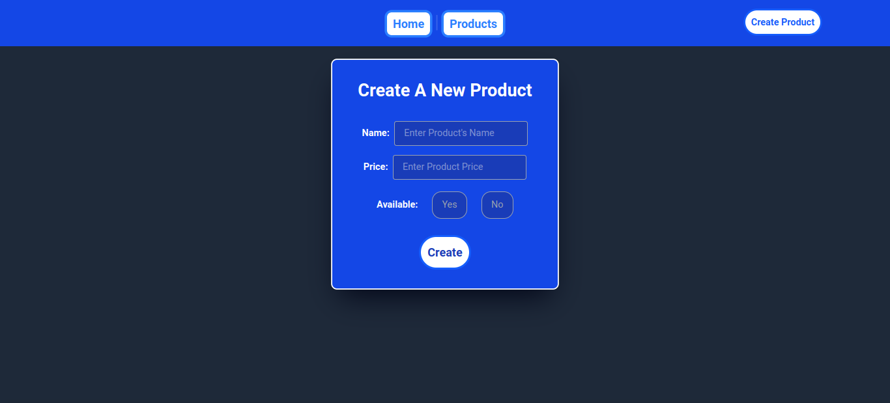
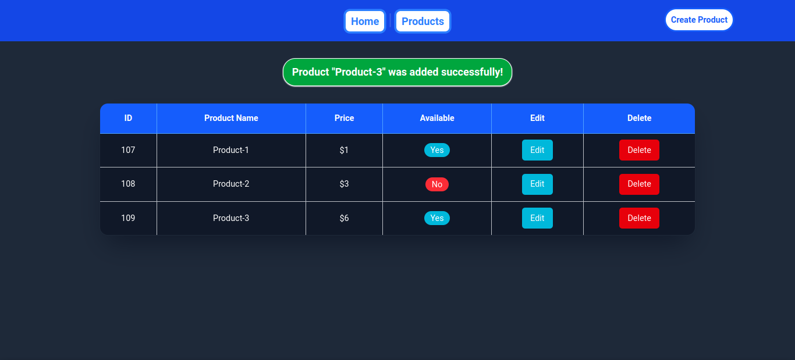
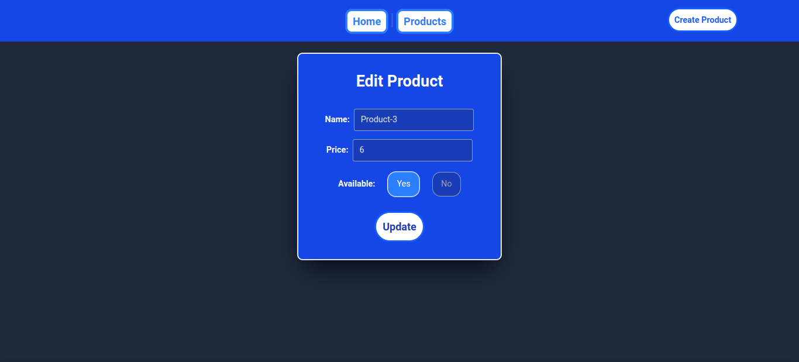

# :triangular_flag_on_post: Laravel Basic CRUD

This is a simple Laravel-based CRUD (Create, Read, Update, Delete) application that demonstrates the use of **RESTful APIs**, **Eloquent ORM**, **MVC architecture**, **Blade templates**, and **MySQL** as the database.

## :rocket: Features
- Full CRUD functionality for managing products.
- Uses **Laravel Sail** for easy local development in Docker.
- Styled with **Tailwind CSS**.
- Clean and well-structured code following Laravel best practices.
- Uses **Eloquent ORM** for database interactions.

## :camera_flash: Screenshots
### :house_with_garden: Home Page


### :heavy_plus_sign: Create Product Page


### :memo: Products List Page


### :pencil2: Edit Product Page


## :hammer_and_wrench: Installation

### :round_pushpin: Prerequisites
- [Docker](https://www.docker.com/) installed.
- [Git](https://git-scm.com/) installed.
- [Node.js](https://nodejs.org/) installed (ensure **npm** is included during installation).
- [Composer](https://getcomposer.org/) installed.

### :gear: Setup:
***:white_medium_small_square: Clone the repository:***
```sh
git clone https://github.com/Mhmdxc/Laravel_Basic-CRUD.git
cd Laravel_Basic-CRUD
```

***:white_medium_small_square: Install PHP dependencies using Composer:***
```sh
composer install
```

***:white_medium_small_square: Install JavaScript dependencies using npm:***
```sh
npm install
```

***:white_medium_small_square: Copy the example environment file:***
```sh
cp .env.example .env
```
 > Update the `.env` file with your database credentials and other necessary configurations.

***:white_medium_small_square: Start the containers:***
```sh
./vendor/bin/sail up -d
```

***:white_medium_small_square: Generate an application key:***
```sh
./vendor/bin/sail artisan key:generate
```

***:white_medium_small_square: Run database migrations:***
```sh
./vendor/bin/sail artisan migrate
```
 > After running the migrations, if you encounter any issues, it's likely due to MySQL not being fully loaded yet. In such cases, try waiting a few moments and then re-running the migration command.

***:white_medium_small_square: Start Vite (for Tailwind styles and JS bundling):***
```sh
npm run dev
```

### :white_check_mark: Now, the application should be accessible at **http://localhost**. :white_check_mark:

## Stopping the Application
To stop the application, follow these steps:
***:white_medium_small_square: In the terminal where your front-end development server is running, press Ctrl + C to stop the 'npm run dev' process.***
***:white_medium_small_square: Stop the Docker containers by running the following command:***
```sh
./vendor/bin/sail down
```
This will stop the application and remove all running Docker containers.

## Starting the Application
To start the application, run the following commands:
***:white_medium_small_square: Start the Laravel Sail environment:***
```sh
./vendor/bin/sail up
```
 > This will start the Docker containers for your Laravel application.

***:white_medium_small_square: In another terminal window, run the following to start the development server:***
```sh
npm run dev
```
 > This will start the front-end development server

### :white_check_mark: Once both commands are running, your application should be accessible at **http://localhost**. :white_check_mark:

## API Endpoints
This application provides a RESTful API for managing products:
- `GET /products` - Retrieve all products.
- `POST /products` - Create a new product.
- `GET /products/{id}` - Retrieve a specific product.
- `PUT /products/{id}` - Update a product.
- `DELETE /products/{id}` - Delete a product.

## Technologies Used
- **Laravel** (PHP framework)
- **MySQL** (Database)
- **Blade** (Laravel templating engine)
- **Eloquent ORM** (Database management)
- **Tailwind CSS** (Styling)
- **Vite** (Frontend asset bundling)

## License
This project is open-source and available under the [MIT License](LICENSE).
"